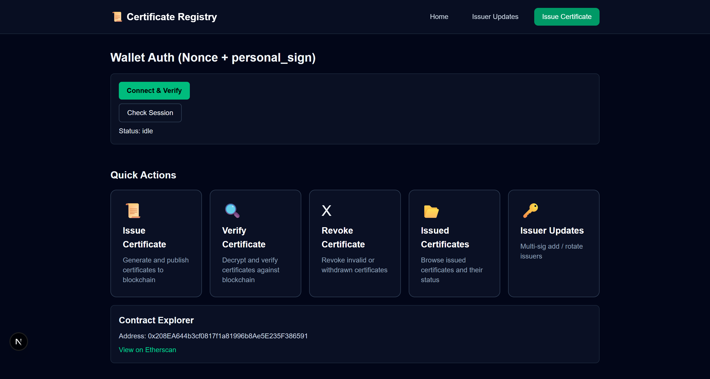
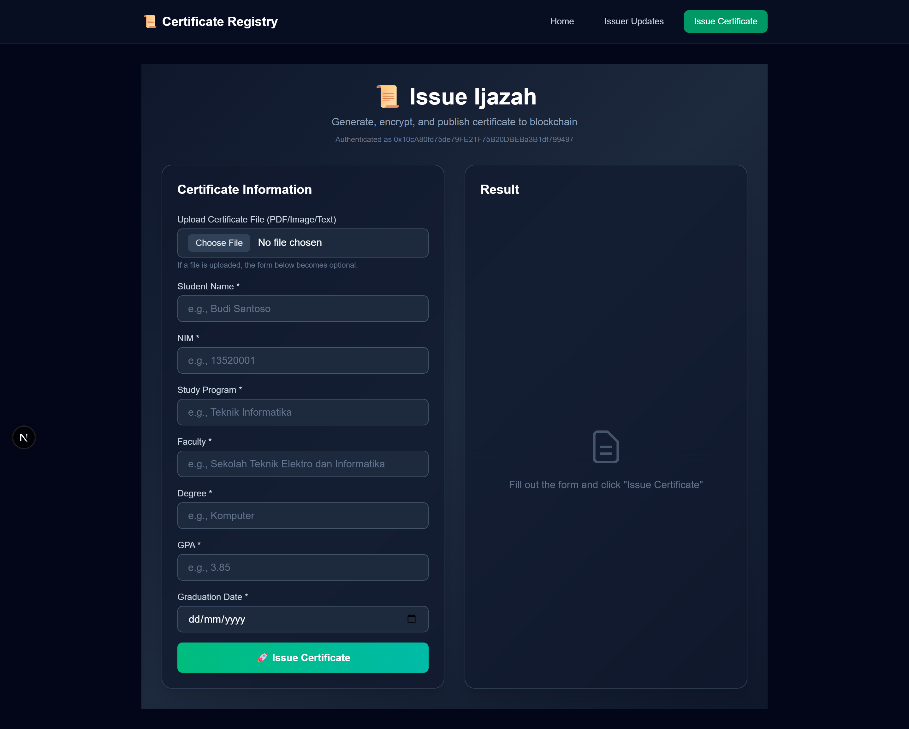
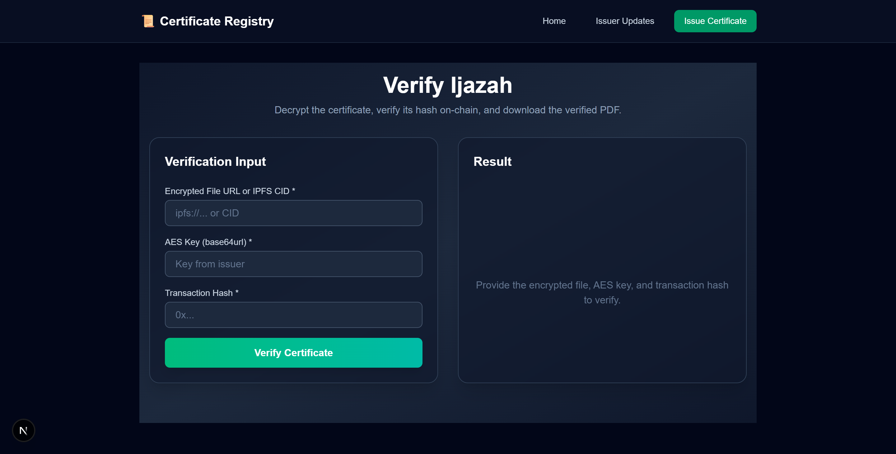
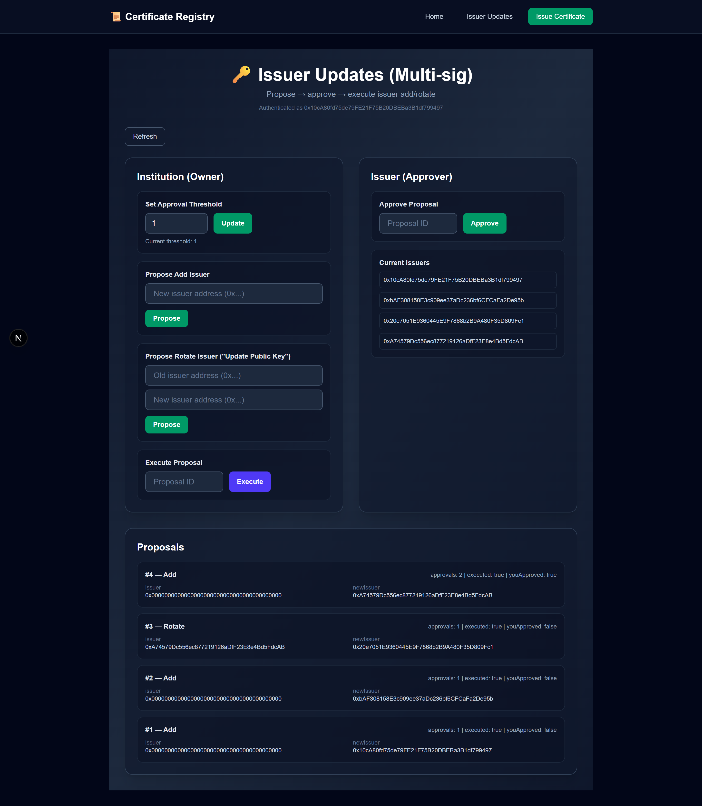

# Sistem Pencatatan Ijazah Digital Berbasis *Blockchain* atau *Centralized Immutable Ledger*

> Maraknya ijazah palsu menuntut sistem pencatatan ijazah yang transparan. Blockchain dapat dimanfaatkan dengan ijazah digital yang ditandatangani rektor menggunakan kriptografi kunci publik dan fungsi hash.

## Deskripsi Proyek

Proyek ini merupakan implementasi **Sistem Pencatatan Ijazah Digital** berbasis **blockchain** atau **centralized immutable ledger** untuk menjamin keaslian dan integritas ijazah digital. Sistem dirancang untuk mengatasi pemalsuan ijazah dengan menyediakan mekanisme penerbitan, penyimpanan, pencabutan, dan verifikasi ijazah yang transparan dan tidak dapat diubah.

Ijazah diterbitkan oleh **Admin Institusi** dalam bentuk dokumen digital (PDF, gambar, atau teks) yang di-hash menggunakan **SHA-256** dan ditandatangani secara digital menggunakan **ECDSA**. Dokumen ijazah disimpan secara **off-chain** dalam keadaan terenkripsi menggunakan **AES**, sementara metadata ijazah dicatat pada ledger untuk menjaga efisiensi dan privasi.

Sistem mendukung dua transaksi utama, yaitu **Issue Certificate** dan **Revoke Certificate**. Publik dapat melakukan verifikasi keaslian ijazah melalui website dengan memanfaatkan transparansi dan sifat immutable dari ledger. Autentikasi Admin Institusi dilakukan menggunakan mekanisme kriptografi berbasis **signature nonce challenge**.


## Screenshots

- **Home / Landing Page**

<div align="center">
	
</div>

- **Issue Certificate**

<div align="center">
	
</div>

- **Issued Certificates**

<div align="center">
	
</div>

- **Verify Certificate**

<div align="center">
	
</div>

- **Revoke Certificate**

<div align="center">
	
</div>

- **Issuer Updates**

<div align="center">
	
</div>


## Daftar Fungsi

### 1) Autentikasi Admin (Institusi)
- **generateNonce(address)**  
	Membuat nonce acak untuk proses login Admin berbasis wallet.  
	(web/src/lib/nonce.ts)

- **loginMessage(nonce)**  
	Membuat pesan login yang harus ditandatangani wallet.  
	(web/src/lib/messages.ts)

- **Verifikasi Signature Login**  
	Signature nonce diverifikasi di backend (API route auth/verify/route.ts).

### 2) Pembuatan & Pemrosesan Ijazah
- **generateCertificatePDF(data)**  
	Membentuk dokumen ijazah (PDF) dari data input.  
	(web/src/lib/pdf/generateCertificate.ts)

- **sha256(fileBytes)**  
	Menghitung hash dokumen ijazah menggunakan SHA-256.  
	(web/src/lib/crypto/hash.ts)

- **createIssueTypedData(data), signTypedData(...)**  
	Menyiapkan dan menandatangani data ijazah secara digital (ECDSA, EIP-712).  
	(web/src/lib/eip712.ts)

### 3) Enkripsi & Penyimpanan Off-chain
- **generateAesKey()**  
	Membuat kunci AES untuk enkripsi dokumen ijazah.  
	(web/src/lib/crypto/aes.ts)

- **encryptAesGcm(key, data), decryptAesGcm(key, payload)**  
	Mengenkripsi dan mendekripsi dokumen ijazah menggunakan AES-GCM.  
	(web/src/lib/crypto/aes.ts)

- **pinFile(name, content, mimeType)**  
	Mengunggah file terenkripsi ke IPFS (off-chain storage) dan mengembalikan CID.  
	(web/src/lib/ipfs/pinata.ts)

### 4) Interaksi Smart Contract (On-chain)
- **getCertificateRegistry(signerOrProvider)**  
	Mendapatkan instance smart contract CertificateRegistry.  
	(web/src/lib/contract.ts)

- **issueCertificate(...)**  
	Fungsi smart contract untuk mencatat metadata ijazah ke blockchain.  
	(contracts/contracts/CertificateRegistry.sol)

- **revokeCertificate(...)**  
	Fungsi smart contract untuk mencabut ijazah.  
	(contracts/contracts/CertificateRegistry.sol)

## Cara Menjalankan Program
### 0. Konfigurasi Environment (.env)

Sebelum menjalankan aplikasi, pastikan sudah membuat file `.env` pada masing-masing folder berikut:

#### a. Folder `contracts`

Tambahkan variabel berikut ke file `contracts/.env`:

```env
ALCHEMY_API_URL=
SEPOLIA_PRIVATE_KEY=    # private key issuer/admin (Metamask) TANPA 0x
ETHERSCAN_API_KEY=    # untuk verify kontrak
```

#### b. Folder `web`

Tambahkan variabel berikut ke file `web/.env`:

```env
NEXT_PUBLIC_CONTRACT_ADDRESS=0x208EA644b3cf0817f1a81996b8Ae5E235F386591
NEXT_PUBLIC_DEPLOY_TX_HASH=0x1218bceda35fe3079031a9ca42289aa4bc8b846a3cf8ba4c699ebe5b15bdf0b4
NEXT_PUBLIC_CHAIN_ID=11155111
NEXT_PUBLIC_ALCHEMY_RPC_URL=https://eth-sepolia.g.alchemy.com/v2/EE-q9pXO02LXVEySEaHLq   # shareable RPC URL

PINATA_JWT=  
PINATA_API_KEY=  
PINATA_API_SECRET=  

SESSION_SECRET=   
```

### 1. Menjalankan Web/Frontend

Masuk ke folder web:

```bash
cd web
```

Install dependencies:

```bash
npm install
npm i --save-dev @types/qrcode
```

Jalankan aplikasi:

```bash
npm run dev
```

Aplikasi akan berjalan di http://localhost:6173.

### 2. Smart Contracts

- Folder `contracts` berisi kode smart contract dan script deployment.
- **tidak perlu menjalankan ulang** bagian ini kecuali ada perubahan pada smart contract.
- Jika perubahan dilakukan pada smart contract, lakukan deploy ulang dengan perintah berikut (dari dalam folder `contracts`):

```bash
npx hardhat run scripts/deploy.ts --network sepolia
```

## Pembagian Kerja

| Nama                        | NIM        | Tugas Spesifik                                                                                      |
|-----------------------------|------------|-----------------------------------------------------------------------------------------------------|
| Aland Mulia Pratama         | 13522124   | Implementasi fitur penerbitan ijazah (Issue Certificate):<br>- Form input data ijazah<br>- Enkripsi ijazah (AES)<br>- Upload ke IPFS/storage<br>- Hash dokumen (SHA-256) |
| Christian Justin Hendrawan  | 13522135   | Implementasi fitur verifikasi ijazah:<br>- Halaman verifikasi publik<br>- Download & dekripsi ijazah<br>- Verifikasi hash & signature<br>- Tampilkan status keaslian ijazah<br>- Integrasi dengan blockchain explorer/ledger viewer<br>- Simpan metadata ke blockchain/ledger<br>- Tampilkan URL/QR code ijazah<br>- Tanda tangan digital (ECDSA) |
| Axel Santadi Warih          | 13522155   | Implementasi fitur pencabutan ijazah (Revoke Certificate):<br>- Form revoke & alasan pencabutan<br>- Tanda tangan digital revoke<br>- Update status di blockchain/ledger<br>- Tampilkan status revoke di publik<br>Bonus: Transaksi pembaruan data (update public key issuer, multi-signature issuer) |